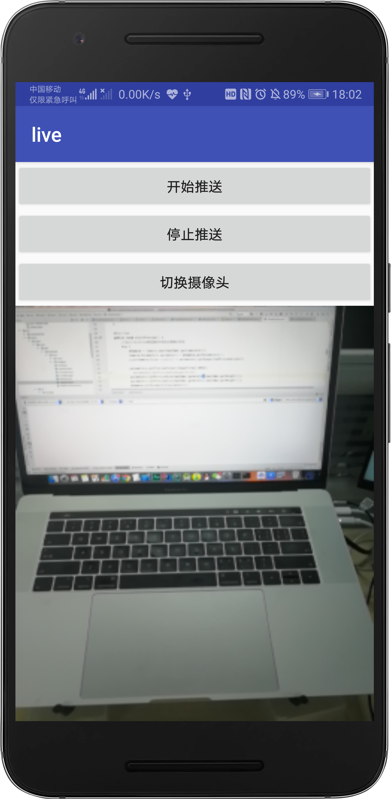

# Live
RTMP协议Android直播解决方案，使用H264标准下X264进行视频编码处理以及AAC对PCM流的编码处理。
## APP Client Pusher

## Web Pull

# License

    Copyright 2019 ben622

    Licensed under the Apache License, Version 2.0 (the "License");
    you may not use this file except in compliance with the License.
    You may obtain a copy of the License at

        http://www.apache.org/licenses/LICENSE-2.0

    Unless required by applicable law or agreed to in writing, software
    distributed under the License is distributed on an "AS IS" BASIS,
    WITHOUT WARRANTIES OR CONDITIONS OF ANY KIND, either express or implied.
    See the License for the specific language governing permissions and
    limitations under the License.
